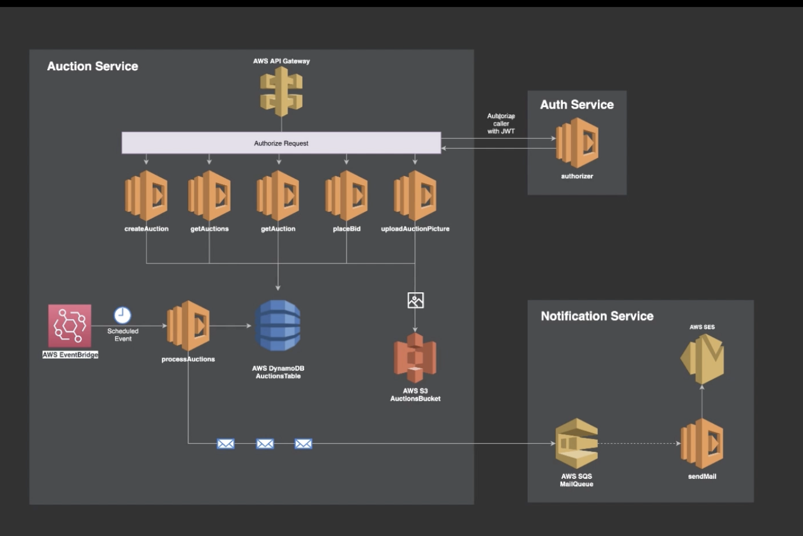

# Architecture



1. Install NodeJS and NPM
```
node --version
```
2. Install AWS CLI and configure it with your credentials
```
aws configure
```
- Billing Alert
    - Billing Dashboard -> Preferences -> Activate
- Create Budget
    - Budgets -> Create Budget -> Cost Budget -> Set your budget amount and period -> Set Alerts

3. Install Postman

3. Install severless client
- *link: https://www.serverless.com/framework/docs/getting-started*
```
npm install -g serverless
sls --version
```
# Codingly.io: Base Serverless Framework Template

https://codingly.io

## What's included
* Folder structure used consistently across our projects.
* [serverless-pseudo-parameters plugin](https://www.npmjs.com/package/serverless-pseudo-parameters): Allows you to take advantage of CloudFormation Pseudo Parameters.
* [serverless-bundle plugin](https://www.npmjs.com/package/serverless-pseudo-parameters): Bundler based on the serverless-webpack plugin - requires zero configuration and fully compatible with ES6/ES7 features.

## Getting started
```
sls create --name auction-service --template-url https://github.com/arielweinberger/sls-base.git
cd auction-service
npm install
```


## Deploy
```
sls deploy -v
sls deploy --stage dev
```

## Remove
```
sls remove -v
sls remove --stage dev
```

## Install Middleware for local development
```
npm install @middy/core @middy/http-json-body-parser @middy/http-error-handler @middy/body-parser http-errors
```


## Check logs
```
sls logs -f createAuction -t
sls logs -f processAuctions -t

sls logs -f createAuction -t --stage dev
```

## Invoke function
```
sls invoke -f processAuctions -l
sls invoke -f createAuction --logs
sls invoke -f createAuction --logs --stage dev
```


npm install @middy/validator


####################
Notification Service

1. sls create --name notification-service --template-url https://github.com/codingly-io/sls-base
2. cd notification-service
3. npm install